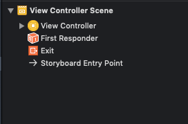
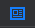
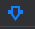
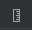
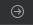

# Getting started

## Defining a const 

```swift
let name = "John"
```

## Defining a mutable variable

```swift
var age = 29
```

## Defining a new Type

```swift
struct Person {
  let firstName: String
  let lastName: String
 
  func sayHello() {
    print("Hello there! My name is \(firstName) \(lastName).")
  }
}
```

## Underscore numbers

Use to separate a number as commas would

```swift
let largePrettyNumber = 1_000_000_000
```

## Specify a Type

```swift
let distance: Double = 1.234
```

## Dividing whole Ints

When you use the division operator (/) on Int values, the result will be an Int value rounded down to the nearest whole number, because the Int type supports whole numbers.

## Converting between types

```swift
let pi = Double(x) + y
```

## If statement

```swift
if temperature >= 100 {
  print("The water is boiling.")
}
```

## If else statement

```swift
if finishPosition == 1 {
  print("Congratulations, you won the gold medal!")
} else if finishPosition == 2 {
  print("You came in second place, you won a silver medal!")
} else {
  print("You did not win a gold or silver medal.")
}
```

## Switch statements

```swift
if finishPosition == 1 {
  print("Congratulations, you won the gold medal!")
} else if finishPosition == 2 {
  print("You came in second place, you won a silver medal!")
} else {
  print("You did not win a gold or silver medal.")
}
```

### Multiple condition switch statement

```swift
switch character {
case "a", "e", "i", "o", "u" :
    print("This character is a vowel.")
default: 
    print("This character is a consonant.")
}
```

### Interval matching switch statement

```swift
switch distance {
case 0...9:
    print("Your destination is close.")
case 10...99:
    print("Your destination is a medium distance from here.")
case 100...999:
    print("Your destination is far from here.")
default: 
    print("Are you sure you want to travel this far?")
}
```

## Ternary statement

```swift
largest = a > b ? a : b
```

## Xcode shortcuts

* `Command-B` Build the project 
* `Command-R` Build and run the project
* `Command-/` Toggle comments on selected rows of code
* `Command-[` Shift the selected code left
* `Command-]` Shift the selected code right

## Wirelessly connect to device

Xcode also gives you the option of deploying an app to your device over your network. To do this, connect your iOS device to your Mac using the appropriate USB cable, and open the Devices and Simulators window by selecting Devices and Simulators from the Window dropdown.

## Open documentation

`cmd-shift-0`

## Interface Builder

### Storyboards

a storyboard file includes many pieces of the interface, defining the layout of one or many screens as well as the progression from one screen to another

### Defining the start screen of the app

Clicking on the top most project file, navigate to `Deployment`. Next to `Main Interface` will be the storyboard used to define the screens for the app.

Within this Storyboard, move the floating arrow to define the starting screen. 

### Document outline view



The Document Outline displays a list of each view controller in the scene, along with a hierarchical list of the elements within each view controller

### Utility area

#### Identity inspector



Allows you to edit the properties related to an object's identity, such as what class it belongs to

#### Attributes inspector



Provides a list of adjustable visual properties for the selected item

#### Size inspector



Allows you to adjust the size and position of the selected element within the scene. You'll use the X and Y fields—where the top left of the screen corresponds to (0,0)—to change the position

#### Connections inspector



The Connections inspector  lists all the functions and variable names related to the object

### Outlets

To create an outlet right click and drag from the interface builder into the views view controller. A dialog box will giving you the option to create an IBOutlet. 

To reference visual elements from code, we link up the pieces using Outlets and when you want a user to interact with an element, you create an action - code that will execute when the element is selected.

IBOutlets can be strong or weak. This refers to how they are held in memory. An object that has a strong reference to the outlet will never be destroyed. A weak reference means the outlet will be destroyed as soon as any strong references to it are removed.

#### Strong
```swift
@IBOutlet var centerButton: UIButton!
```

#### Weak
```swift
@IBOutlet weak var centerButton: UIButton!
```

The exclamation mark is also used in the syntax for declaring "Implicitly Unwrapped Optionals".

A john variable can be declared as var john:Person?, and it is an Optional. If you want the actual value of that variable, you must unwrap it.

If it were declared as var john:Person! instead, the variable would be an Implicitly Unwrapped Optional. There is no need to unwrap this kind of variable when accessing the value, and john can be used without additional syntax. 

### Actions

To create an action, right click and drag to the view's view controller and select action from the dropdown. Make sure to change the type to the type of the element in the view.

To see how a view element connects to a view controller, select the element in interface builder and select the connections inspector in the utility tab.

### Programmatically creating views

All views can be programmatically created inside a view controller instead of magically through interface builder.

```swift
let label = UILabel(frame: CGRect(x: 16, y: 16, width: 200, height: 44))
view.addSubview(label)
```

Interface builder just makes this easier. Note, not all attributes of a view can be modified in the attributes selector, some *have* to be modified programmatically. 