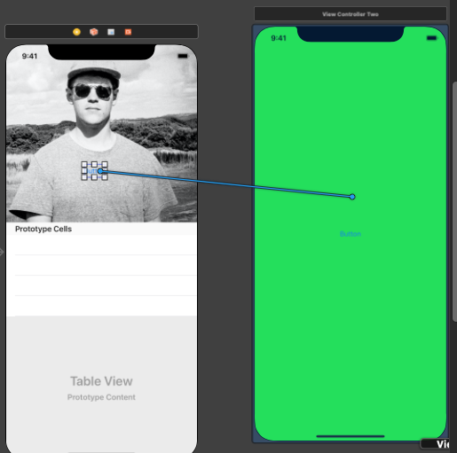
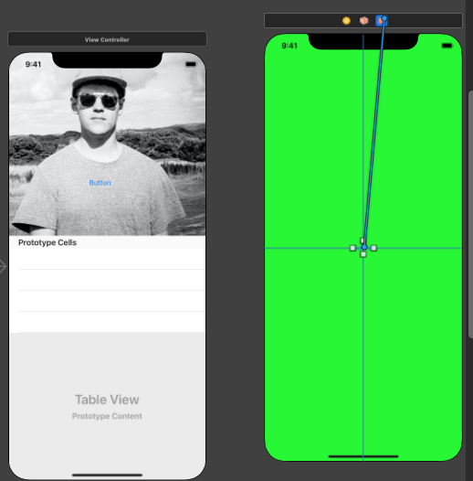

# UIKit - sdk

A view is a clear rectangular shape that can be customized to display anything on the screen. Text, images, lines, and graphics are all created using instances of UIView.

To display a view onscreen, you need to give it a frame—which consists of a size and a position—and add it to the view hierarchy. The area within the view is its bounds.

## Segues

Create a segue in the interface builder by right click and dragging from a button to in a screen to another another screen. 



### Unwinding

To unwind a bunch of segue transition back to the original screen. Add the following code to the original screen:

```swift
@IBAction func unwindSegue(unwindSegue: UIStoryboardSegue) {
  // Can send data back to the original screen
}
```

Then from the unwinding screen, right click and drag from a button to the `exit` button:



