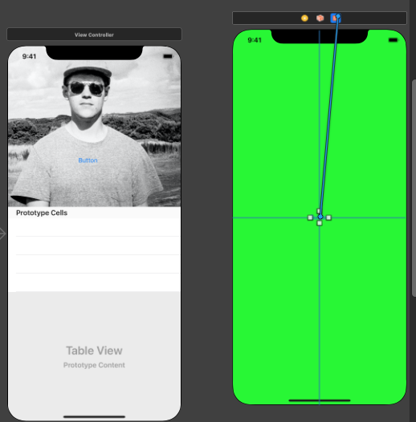

# Navigation and work flows - sdk

A view is a clear rectangular shape that can be customized to display anything on the screen. Text, images, lines, and graphics are all created using instances of UIView.

To display a view onscreen, you need to give it a frame—which consists of a size and a position—and add it to the view hierarchy. The area within the view is its bounds.

## Set initial view controller 

Select the view controller in the document outline and select `Is initial view controller` in attributes inspector.


## Segues

Create a segue in the interface builder by right click and dragging from a button to in a screen to another another screen. 


### Unwinding

To unwind a bunch of segue transition back to the original screen. Add the following code to the original screen:

```swift
@IBAction func unwindSegue(unwindSegue: UIStoryboardSegue) {
  // Can send data back to the original screen
}
```

Then from the unwinding screen, right click and drag from a button to the `exit` button:



### Passing information between segues

To pass information from an original screen to the next when it segues, the following function is created in the original screen

```swift
override func prepare(for segue: UIStoryboardSegue, sender: Any?) {
    segue.destination.navigationItem.title = "New screen's title text"
}
```

This function makes available the incoming screen, so we can attached information to it.

### Programmatic segues

By naming segues created in IB we can prepare and call them in code. First create a generic segue from one view controller to another.


Select the segue and name it in the attributes inspector


In some function you can then push the segue by calling:

```swift
@IBAction func pushToYellow(_ sender: UIButton) {
    performSegue(withIdentifier: "yellow", sender: nil)
}
```

## Navigation controllers

Too embed an entire storyboard flow in a navigation controller. Select the view controller of the first screen in the Document Outline and choose `Editor > Embed In > Navigation Controller`.


When you add a navigation controller in this way, a `navigation item` is added to the root view controller in the Document outline. This allows you to edit the title of the controller as well as its back button. If you want to do a similar thing to other view controllers, navigation items can be taken from the object library and added to the Document outline.


### Bar button

If a `navigation item` has been added, you can add bar buttons to the navigation. These can be left or right handed buttons on the navigation controller for generic actions like `save` or `bookmark`.


### Large titles

Select the `Naviation Bar` in the `Navigation Controller Scene` and select `Prefer Large Titles` in the attributes inspector


## Tab bar controllers

Select the initial view controller in IB and choose `Editor > Embed In > Tabbar Controller`.


### Add more tabs

Create new view controller in IB then drag from the `tab bar controller` to the new view controller.


Select `view controllers` under `relationship segue` in the pop up menu.


### Customize tab bar

Select tab bar item in the Document outline and make changes in the attributes inspector.


### Badges

Can be added either in the attributes inspector or programmatically.

```swift
tabBarItem.badgeValue = "!"
```

## View controller lifecycle


Always call the superclass equivalent method inside the lifecycle method first and make sure to use keyword `override` e.g.

```swift
override func viewWillAppear(_ animated: Bool) {
    super.viewWillAppear(animated)
    // Add your code here
}
```

### View Did Load

```swift
viewDidLoad(_:)
```

* Work only performed one time
* Updating a label's font, text, or color

### View Will Appear

```swift
viewWillAppear(_:)
```

* Requesting users location
* Starting network requests
* Refreshing or updating views (such as the status bar, navigation bar, or table views)
* Adjusting to new screen orientations

### View Did Appear

```swift
viewDidAppear(_:)
```

* Work that needs to be performed each time the view appears\
* Starting an animation
* Long running tasks e.g. fetching data

### View Will Disappear

```swift
viewWillDisappear(_:)
```

* Saving edits
* Hiding keyboard
* Canceling network requests

### View Did Disappear

```swift
viewDidDisappear(_:)
```

* Stop services related to view e.g. playing audio
* Removing notification observers

## Stacks

Items in IB can be combined together in stacks to reduce the amount of constraints necessary on it.

Select multiple items and choose `Editor > Embed In > Stack`.

## Hide items in Interface Builder

Select the item in IB and at the bottom of the attributes selector, deselect `Installed`


