# Tables and Persistence - sdk

## Scroll views

* Can be added in IB by selecting scroll view in the object model and dragging to view controller.

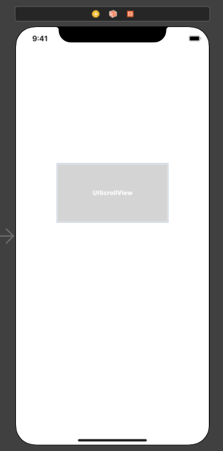

* Add constraints to make the scroll view fill the screen.

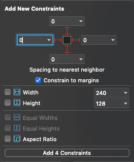

* Add a stack view as a subview of scroll view
* Make it the same size as the scroll view

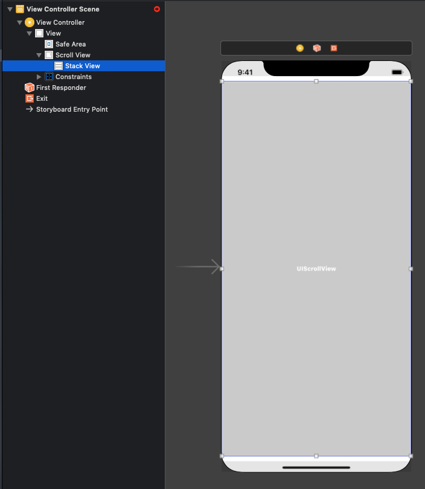

* Add constraints to all edges of the stack view

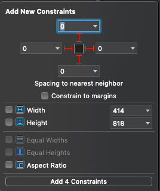

* Add a view as a subview of the stack view
* Move to top left corner
* In the Document outline, right-click drag from the view to the scroll view

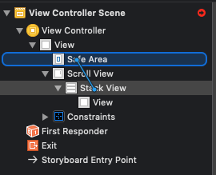

* Select `Equal Widths`

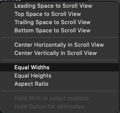

### keyboard

When a keyboard displays it can block some of a scroll view. Use the following to push content up inside a scroll view when a keyboard shows.

```swift
func registerForKeyboardNotifications() {
        NotificationCenter.default.addObserver(self, selector: #selector(keyboardWasShown(_:)), name: UIResponder.keyboardDidShowNotification, object: nil)
        NotificationCenter.default.addObserver(self, selector: #selector(keyboardWillBeHidden(_:)), name: UIResponder.keyboardWillHideNotification, object: nil)
    }

    @objc func keyboardWasShown(_ notificiation: NSNotification) {
        guard let info = notificiation.userInfo, let keyboardFrameValue = info[UIResponder.keyboardFrameBeginUserInfoKey] as? NSValue else { return }
        let keyboardFrame = keyboardFrameValue.cgRectValue
        let keyboardSize = keyboardFrame.size
        let contentInsets = UIEdgeInsets(top: 0.0, left: 0.0, bottom: keyboardSize.height, right: 0.0)
        scrollView.contentInset = contentInsets
        scrollView.scrollIndicatorInsets = contentInsets
    }
    
    @objc func keyboardWillBeHidden(_ notification: NSNotification) {
        let contentInsets = UIEdgeInsets.zero
        scrollView.contentInset = contentInsets
        scrollView.scrollIndicatorInsets = contentInsets
    }
```

## Tables

There are two ways of adding a table view.

1. Add table view instance directly to a view controller's view
* You're responsible for auto layout
* You're responsible for setting the Data Source object
* You're responsible for setting the delegate object

2. Add a table view controller to your Storyboard from the Object library
* Table view takes up the entire view
* The provided table view controller acts as the data source and the delegate
* You get free functionality

### Setup the table

Pull in a table view controller from the object library

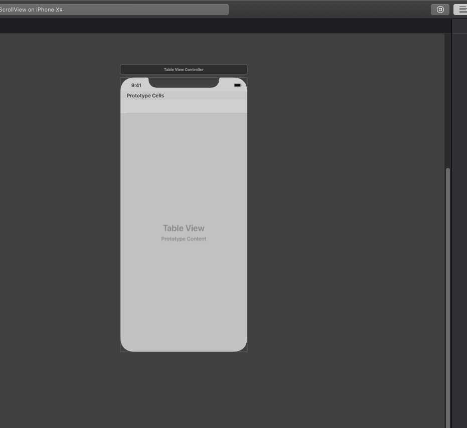

Embed the table view in a navigation controller

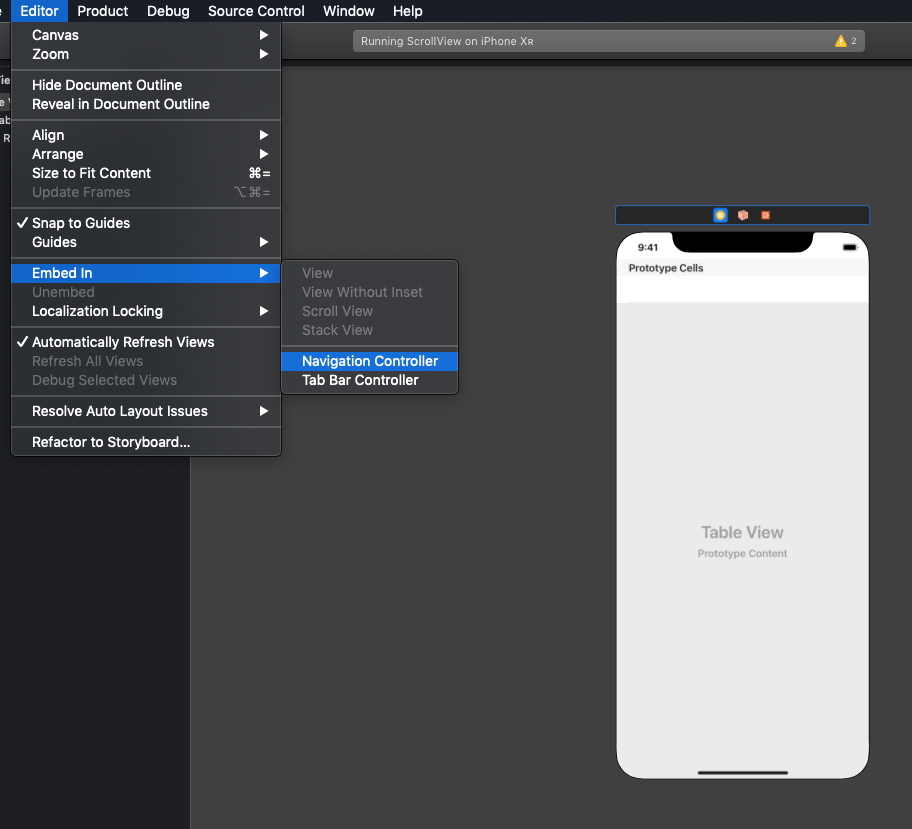

Make the navigation controller the initial controller (if necessary)

Create a new Cocoa touch class as a subclass of `UITableViewController`

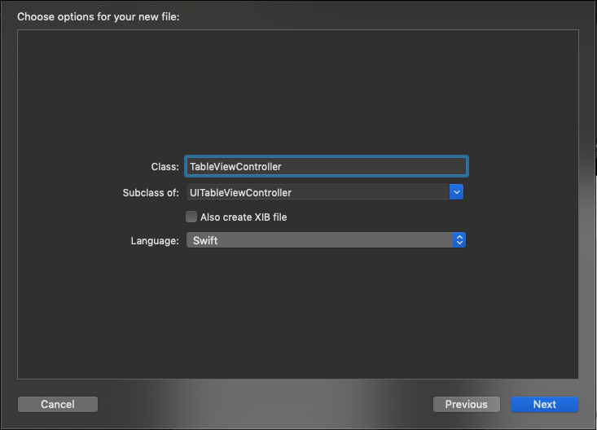

In Storyboard, make the new view controller a custom class for the table view controller

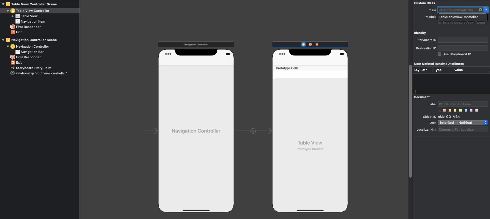

### Table view cell

The UITableViewCell class defines three properties for cell content:

* textLabel, a UILabel for the title
* detailTextLabel, a UILabel for the subtitle (if there's additional detail)
* imageView, a UIImageView for an image

### Table vie cell style

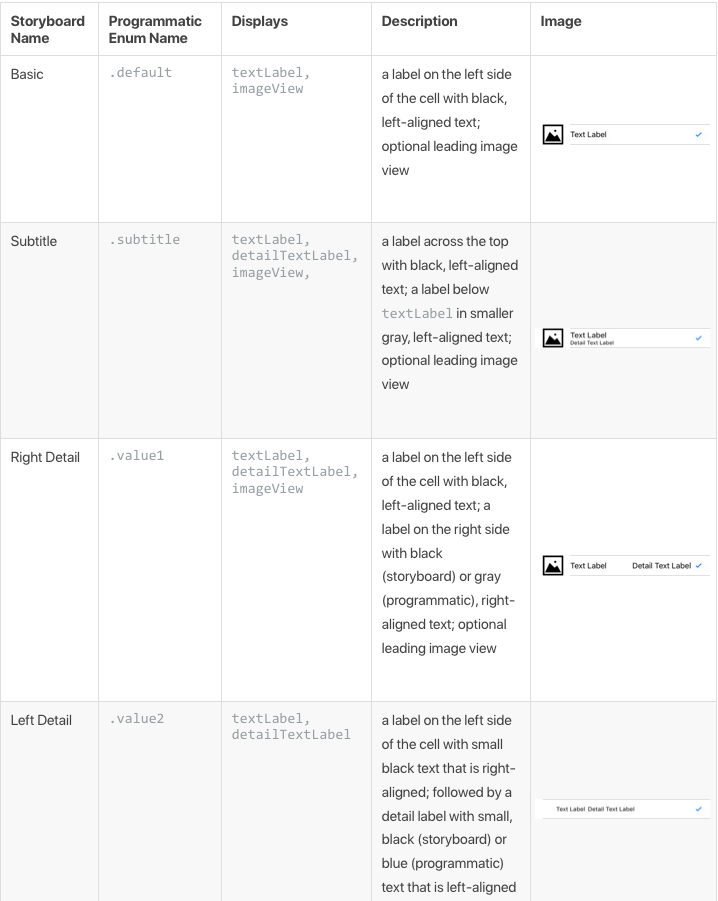

### indexPath

An index path points to a specific row in a specific section of a table view. You can access these values through the row and section properties. Just like in arrays, these values are zero-based

### Table view protocols

The UITableView class itself doesn't have the methods or properties to configure its own contents; instead, table views delegates that responsibility to other objects. The data source and delegate are often, but not necessarily, the same object. Typically this object is your custom subclass of UITableViewController.
 
### Data source methods

Remove if there is only one section

```swift
optional func numberOfSections(in tableView: UITableView) -> Int
```

List the number of cells in a table

```swift
override func tableView(_ tableView: UITableView, numberOfRowsInSection section: Int) -> Int {
    // #warning Incomplete implementation, return the number of rows
    return data.count
}
```

Configure the cell with your data

```swift
override func tableView(_ tableView: UITableView, cellForRowAt indexPath: IndexPath) -> UITableViewCell {
    let cell = tableView.dequeueReusableCell(withIdentifier: "EmojiCell", for: indexPath)
    let emoji = self.emojis[indexPath.row]
    cell.textLabel?.text = "\(emoji.symbol) - \(emoji.name)"
    cell.detailTextLabel?.text = emoji.description
    cell.showsReorderControl = true
    
    return cell
}
```

The `identifier` will need to be setup within the Storyboard to be used in the above function.

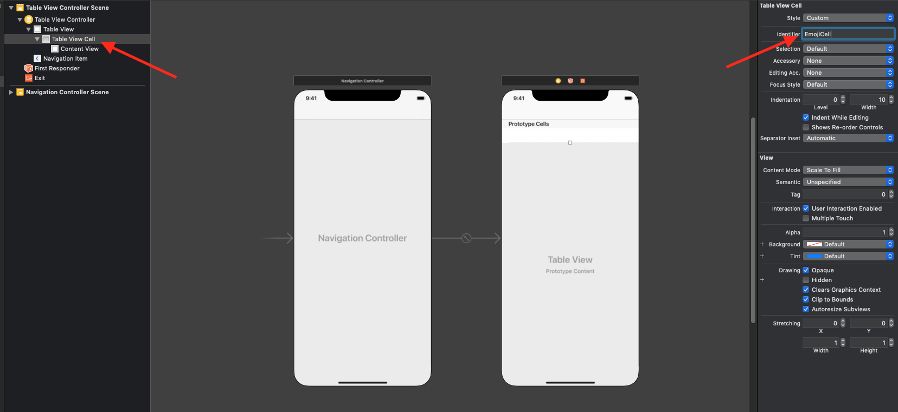

### Table view delegate

The delegate object, which conforms to the UITableViewDelegate protocol, implements methods to modify visible aspects of the table view, manage selections, support an accessory view, and support editing of individual rows in a table behavior. Unlike the data source protocol, the delegate protocol has no required methods.

#### Accessory button tapped for row

Called if the cell has a detail or a detail disclosure accessory type and the user taps the detail indicator.

```swift
override func tableView(_ tableView: UITableView, accessoryButtonTappedForRowWith indexPath: IndexPath) {
    // open modal view to show details or something
}
```

#### Did select row

```swift
override func tableView(_ tableView: UITableView, didSelectRowAt indexPath: IndexPath) {
    // do something with the selected row
}
```

#### Reorder cells

Add an edit button to the table

```swift
override func viewDidLoad() {
    super.viewDidLoad()
    navigationItem.leftBarButtonItem = editButtonItem
}
```

Add function called on reorder

```swift
override func tableView(_ tableView: UITableView, moveRowAt fromIndexPath: IndexPath, to: IndexPath) {
    let movedEmoji = emojis.remove(at: fromIndexPath.row)
    emojis.insert(movedEmoji, at: to.row)
    tableView.reloadData()
}
```

#### Delete row

Called when delete button is selected in edit mode

```swift
override func tableView(_ tableView: UITableView, commit editingStyle: UITableViewCell.EditingStyle, forRowAt indexPath: IndexPath) {
    emojis.remove(at: indexPath.row)
    tableView.deleteRows(at: [indexPath], with: UITableView.RowAnimation.fade)
}
```

